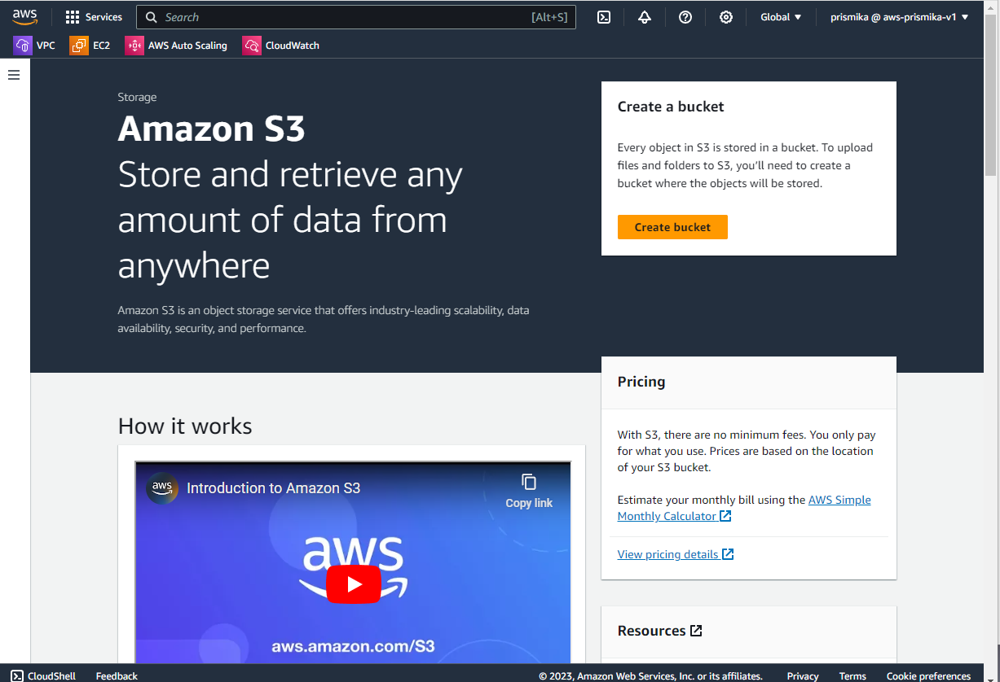

# Creating Buckets and Uploading Objects

1) Search S3 on top bar of services and create bucket 

    

2) Fill in unique name as well as the region you want to be selected. Leave the rest of the configuration the same.

    

3) Our bucket has been created- each bucket is assigned to a specific region, in this case eu-west-1. 

    

4) Now click on the bucket, and lets start uploading objects. Click on upload. I’ve uploaded a cat.jpg for test. 

    

    

5) Now after you have uploaded, go into your bucket again and click on the object for a overview. Click on open on the top right and your image should appear in a new webpage. (preassigned url)

    

    

6) However, if we wanted to access our url by copy and pasting the object url, we will get a access denied error. This means we cannot access our image using the public url, as our image is not public. 

    

7) Now, within the bucket, we are going to create a folder called **images**.

    

    

8) In our new images folder, I have uploaded a new jpg file.

    

9) You can also delete by just clicking on the folder or image and pressing delete on the task bar. 

    